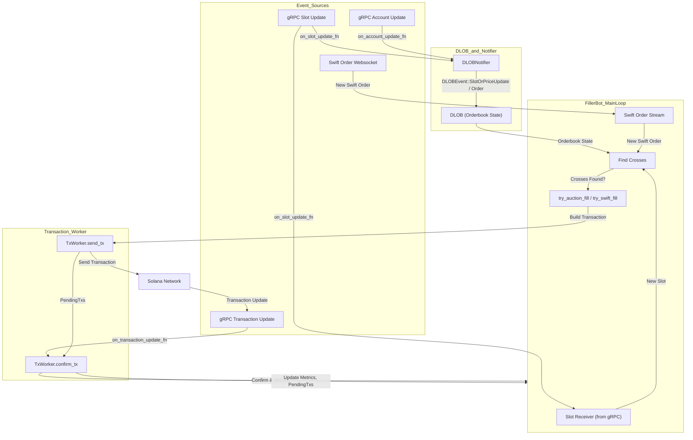

## Event Flow Diagram

The following diagram illustrates the complete flow of events in the Filler bot, from receiving gRPC and WebSocket events, updating the orderbook (DLOB), to sending and confirming transactions:



## Event Sources

The Filler bot receives events from multiple sources that drive its operation:

### gRPC Slot Update

Slot updates are the primary timing mechanism for the bot:

- **Frequency**: Approximately every 400ms (Solana slot time)
- **Purpose**: Triggers periodic cross detection for auction orders and limit orders
- **Routing**: Sent to both `DLOBNotifier` (for price updates) and the main loop (for processing)

In the code (filler.rs:259):

```rust
new_slot = slot_rx.recv() => {
    slot = new_slot.expect("got slot update");
    // Check for auction and limit crosses in all markets
    for market in &market_ids {
        let crosses_and_top_makers = dlob.find_crosses_for_auctions(
            market_index, MarketType::Perp, slot, oracle_price, 
            Some(&perp_market), None
        );
        // ...
    }
}
```

<Info>Slot updates create a regular heartbeat for the bot to scan all markets for new opportunities.</Info>

### gRPC Account Update

Account updates notify the bot when on-chain state changes:

- **User Accounts**: Order placements, cancellations, fills, position changes
- **Market Accounts**: AMM state updates, liquidity changes
- **Oracle Accounts**: Price feed updates
- **Routing**: Sent to `DLOBNotifier` to update orderbook state

<Note>The bot subscribes to all user accounts and relevant market accounts via gRPC filters.</Note>

### gRPC Transaction Update

Transaction updates provide confirmation status for submitted transactions:

- **Confirmations**: Transaction landed on-chain successfully
- **Errors**: Transaction failed or was rejected
- **Routing**: Sent directly to `TxWorker.confirm_tx` for processing

This enables the bot to:
- Parse transaction logs to verify expected fills occurred
- Update metrics (success rate, fill rate, latency)
- Remove transactions from pending queue
- Detect competition scenarios (order already filled by others)

### Swift Order WebSocket

Swift orders are off-chain orders submitted directly to Drift:

- **Source**: WebSocket connection to Drift's Swift order service
- **Content**: Signed order parameters with auction details
- **Routing**: Processed directly in the main loop
- **Purpose**: Provides low-latency opportunities to fill orders against resting liquidity

When a Swift order arrives (filler.rs:166):

```rust
swift_order = swift_order_stream.next() => {
    match swift_order {
        Some(signed_order) => {
            let taker_order = TakerOrder::from_order_params(order_params, price);
            let crosses = dlob.find_crosses_for_taker_order(
                slot + 1, oracle_price, taker_order, 
                Some(&perp_market), None
            );
            if !crosses.is_empty() {
                try_swift_fill(/* ... */).await;
            }
        }
    }
}
```

## DLOB and DLOBNotifier

### DLOBNotifier

The `DLOBNotifier` acts as an event processor that updates the DLOB:

**Responsibilities:**
- Receives gRPC slot and account updates
- Batches events for efficient processing
- Parses account data to extract order information
- Emits `DLOBEvent` notifications for DLOB to consume

**Event Types:**
- `SlotOrPriceUpdate`: Triggers auction price recalculation
- `OrderPlaced`: Adds new resting order to DLOB
- `OrderCancelled`: Removes order from DLOB
- `OrderFilled`: Updates or removes filled order

### DLOB (Orderbook State)

The DLOB maintains the complete orderbook state in memory:

**Data Structures:**
- Orders indexed by market, side (bid/ask), and price level
- User order mappings for quick lookups
- Efficient structures for cross detection queries

**Key Operations:**
- `find_crosses_for_auctions()`: Finds auction orders that can be filled
- `find_crosses_for_taker_order()`: Matches taker against resting orders
- `get_top_makers()`: Queries best resting orders for liquidations

See [DLOB documentation](/architecture/dlob) for detailed implementation.

## Main Loop Processing

The Filler bot's main loop uses `tokio::select!` with biased selection:

```rust
loop {
    tokio::select! {
        biased;  // Process in order of definition
        swift_order = swift_order_stream.next() => {
            // Handle Swift orders first (highest priority)
        }
        new_slot = slot_rx.recv() => {
            // Handle slot updates (periodic cross detection)
        }
    }
}
```

### Swift Order Priority

Swift orders are processed first because:
- They represent immediate opportunities
- Other bots may compete for the same fill
- Lower latency provides competitive advantage

### Slot Update Processing

On each slot, the bot:

1. **Update Oracle Prices**: Fetch latest prices from DriftClient
2. **Check Pyth Prices**: Use faster Pyth Lazer feed if available
3. **For Each Market**:
   - Query DLOB for auction crosses
   - Filter crosses using slot limiter (avoid spam)
   - Build and submit fill transactions if crosses found
4. **Calculate Priority Fee**: Use percentile-based fee (50th-60th)
5. **Add Entropy**: Small random component to avoid duplicate tx hashes

## Find Crosses

Cross detection is the core of the Filler bot's logic:

### Auction Crosses

```rust
let crosses_and_top_makers = dlob.find_crosses_for_auctions(
    market_index,
    MarketType::Perp,
    slot,
    oracle_price,
    Some(&perp_market),
    None
);
```

This finds:
- Auction orders where auction price crosses resting liquidity
- AMM (vAMM) opportunities where AMM wants to provide liquidity
- Top maker orders for each crossing taker

### Swift Order Crosses

```rust
let crosses = dlob.find_crosses_for_taker_order(
    slot + 1,
    oracle_price as u64,
    taker_order,
    Some(&perp_market),
    None
);
```

This matches the Swift order against resting limit orders.

### Cross Filtering

Before attempting fills, crosses are filtered:

```rust
crosses_and_top_makers.crosses.retain(|(o, _)| 
    limiter.allow_event(slot, o.order_id)
);
```

The `OrderSlotLimiter` prevents:
- Repeated attempts on the same order within a few slots
- Wasted transactions on orders that consistently fail
- Excessive priority fee spending

## Transaction Building and Sending

When crosses are found, the bot builds a fill transaction:

### try_auction_fill

1. **Build Instruction**: Create `fill_perp_order` instruction
2. **Add Maker Accounts**: Include all crossing maker accounts
3. **Set Compute Budget**: Priority fee + CU limit
4. **Submit to TxWorker**: Send via channel

### try_swift_fill

1. **Build Swift Fill Instruction**: Include signed order data
2. **Add Maker Accounts**: Resting orders to match against
3. **Set Compute Budget**: Higher CU limit for Swift fills
4. **Submit to TxWorker**: Send via channel

### TxWorker

The TxWorker runs in a separate thread:

```rust
let tx_worker = TxWorker::new(drift.clone(), metrics, config.dry);
let tx_worker_ref = tx_worker.run(rt);
```

**send_tx Flow:**
1. Receive transaction request from channel
2. Sign transaction with wallet
3. Send to RPC endpoint
4. Add to `PendingTxs` buffer with metadata
5. Increment send metrics

**confirm_tx Flow:**
1. Receive transaction update from gRPC
2. Look up transaction in `PendingTxs` by signature
3. Fetch full transaction details from RPC
4. Parse logs for fill events
5. Compare actual fills to expected intent
6. Update metrics (success, fill rate, latency)
7. Remove from pending buffer

See [Transaction Lifecycle](/architecture/transaction-lifecycle) for complete flow.

## Feedback Loop

The confirmation feedback loop enables the bot to:

- **Learn Competition Patterns**: Detect which orders are filled by others
- **Optimize Priority Fees**: Adjust fees based on success rate
- **Monitor Performance**: Track fill rates, latency, error types
- **Detect Issues**: Alert on high error rates or stale data

<Info>This event-driven architecture enables the bot to react to opportunities within milliseconds while maintaining reliable transaction handling.</Info>