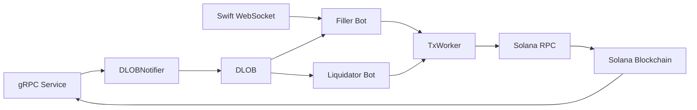

## System Components

Keep-rs keeper bots are built on a modular architecture designed for high-performance, real-time order matching and liquidation on the Drift Protocol. The main components include:

### DriftClient

The `DriftClient` is the core interface to the Drift Protocol. It provides:
- Access to on-chain program data (markets, users, oracles)
- Transaction building and submission capabilities
- Account state management
- Blockhash subscription for transaction validity

<Info>The DriftClient is "leaked" as a static reference in both filler and liquidator bots to enable efficient shared access across async tasks without ownership constraints.</Info>

### DLOB (Decentralized Limit Order Book)

The DLOB maintains an in-memory representation of all resting limit orders across markets. Key features:
- Real-time orderbook state updated via gRPC subscriptions
- Cross detection for auction orders, swift orders, and limit orders
- Top maker queries for matching against liquidations
- Efficient data structure for fast order matching

See [DLOB documentation](/architecture/dlob) for detailed implementation.

### DLOBNotifier

The `DLOBNotifier` processes incoming events and updates the DLOB state:
- Slot updates trigger price recalculations
- Account updates modify user orders in the orderbook
- Batches events for efficient processing
- Emits `DLOBEvent` notifications (slot/price updates, order changes)

### TxWorker

A dedicated background thread that handles transaction lifecycle:
- **Signing and Sending**: Receives transaction requests via channel, signs with wallet, sends to RPC
- **Confirmation Tracking**: Monitors gRPC transaction updates for confirmations
- **Pending Transaction Management**: Maintains a circular buffer of pending transactions
- **Metrics Collection**: Records success/failure rates, latency, and fill rates

<Note>The TxWorker uses a separate thread to avoid blocking the main event loop during transaction operations.</Note>

### gRPC Subscriptions

Real-time data feeds from Drift's gRPC service provide:

**Slot Updates**
- New slot notifications every ~400ms
- Triggers DLOB updates and cross detection cycles
- Used for auction price calculations

**Account Updates**
- User account changes (orders, positions, balances)
- Market account changes (AMM state, liquidity)
- Oracle price updates
- Updates DLOB state and triggers margin checks (liquidator)

**Transaction Updates**
- Confirmation status of submitted transactions
- Routed to TxWorker for confirmation handling
- Enables transaction result parsing and metrics

### Priority Fee Subscriber

The `PriorityFeeSubscriber` dynamically adjusts transaction priority fees:
- Monitors recent transactions for relevant markets
- Calculates percentile-based fees (50th, 60th, etc.)
- Ensures competitive transaction inclusion without overpaying

### Swift Order Stream

For the Filler bot, a WebSocket connection receives off-chain Swift orders:
- Real-time order notifications from Drift's Swift order system
- Orders are matched against resting liquidity in the DLOB
- Provides low-latency order matching opportunities

### MarketState (Liquidator)

The liquidator uses `MarketState` for margin calculations:
- Caches market metadata and oracle prices
- Provides margin requirement calculations
- Identifies liquidatable, high-risk, and safe accounts

## Component Interaction

The components work together in a continuous event-driven loop:



1. **Event Sources** (gRPC, Swift) push updates to the system
2. **DLOBNotifier** processes events and updates the **DLOB**
3. **Bot Logic** (Filler/Liquidator) detects opportunities using DLOB state
4. **TxWorker** executes transactions and tracks confirmations
5. **Blockchain** confirms transactions, triggering metrics updates

## Bot Lifecycle

### Initialization

1. Load configuration from environment variables
2. Connect to Solana RPC and Drift gRPC endpoints
3. Initialize DriftClient with bot's wallet
4. Create DLOB and DLOBNotifier
5. Spawn TxWorker thread
6. Subscribe to gRPC events (accounts, slots, transactions)
7. Subscribe to additional feeds (Swift orders, Pyth prices)
8. Start metrics HTTP server

### Main Loop

The bot enters a continuous `tokio::select!` loop that processes:

**Filler Bot:**
- New slots → Check for auction and limit order crosses
- Swift orders → Match against resting liquidity
- Pyth price updates → Update oracle prices for better execution

**Liquidator Bot:**
- gRPC events (up to 32 per batch) → Update user accounts and oracles
- Margin checks → Identify liquidatable and high-risk users
- Liquidation worker → Process liquidatable users with rate limiting
- Periodic full sweeps → Recheck all users every 64 cycles

### Transaction Execution

When an opportunity is detected:

1. **Build Transaction**: Create Drift instruction with necessary accounts
2. **Add Compute Budget**: Set priority fee and CU limit
3. **Submit to TxWorker**: Send via channel to worker thread
4. **Worker Signs & Sends**: Sign with wallet and submit to RPC
5. **Track Pending**: Add to pending transaction buffer
6. **Await Confirmation**: Worker receives gRPC transaction update
7. **Parse Result**: Extract logs, compare to intent, update metrics

See [Transaction Lifecycle](/architecture/transaction-lifecycle) for details.

## Performance Considerations

### Async Architecture

- Main loop uses `tokio::select!` with biased selection for priority handling
- Swift orders processed first to capture time-sensitive opportunities
- Slot updates processed with lower priority

### Memory Management

- Static references (`&'static`) avoid clone overhead for shared data
- Circular buffers (PendingTxs) prevent unbounded memory growth
- Slot limiters track recent order attempts to avoid spam

### Rate Limiting

- Order slot limiter prevents repeated attempts on same order
- Liquidation rate limiting (5 slots minimum between attempts)
- Priority fee calculation uses percentiles to balance cost and speed

<Note>The architecture is optimized for sub-slot latency, aiming to detect and execute opportunities within the ~400ms Solana slot time.</Note>

## Configuration

Bots are configured via environment variables:

```bash
BOT_PRIVATE_KEY=<base58_private_key>
RPC_URL=<solana_rpc_endpoint>
GRPC_ENDPOINT=<drift_grpc_endpoint>
GRPC_X_TOKEN=<grpc_auth_token>
PYTH_LAZER_TOKEN=<pyth_price_feed_token>
```

Additional configuration through command-line flags:
- `--mainnet` / `--devnet`: Network selection
- `--filler` / `--liquidator`: Bot type
- `--dry`: Simulation mode (no actual transactions)
- `--markets`: Specific markets to operate on

See [Configuration](/bots/configuration) for complete options.