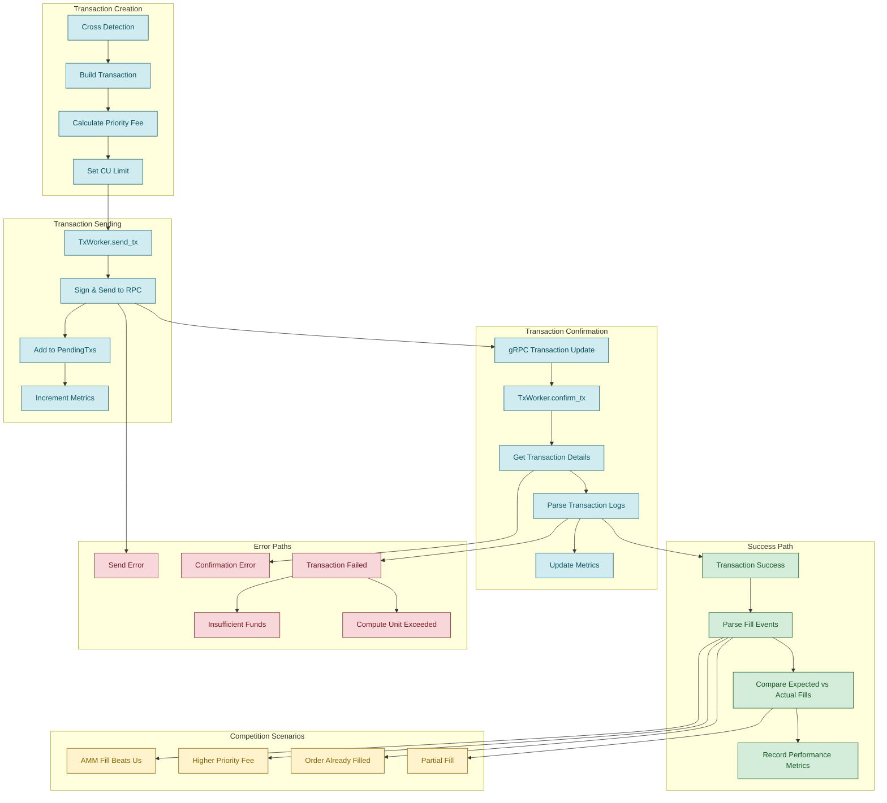

## Transaction Lifecycle Diagram

The following diagram shows the complete lifecycle of a transaction from creation to confirmation, including error handling and competition scenarios:



## Transaction Creation

### Cross Detection

Transactions begin when the bot detects a profitable opportunity:

**Filler Bot:**
- Auction orders crossing resting liquidity
- Swift orders matching resting orders
- Resting limit orders that can be crossed against each other

**Liquidator Bot:**
- Users with `total_collateral < margin_requirement`
- Perp positions that can be filled against DLOB makers
- Spot borrows that can be repaid via Jupiter swaps

See [Event Flow](/architecture/event-flow) for cross detection details.

### Build Transaction

Once a cross is detected, the bot builds a transaction:

**Filler - Auction Fill:**

```rust
let ix = drift.fill_perp_order(
    user_pubkey,
    user_account,
    order_id,
    filler_pubkey,
    Some(maker_infos),
);
```

**Filler - Swift Fill:**

```rust
let ix = drift.fill_swift_order(
    signed_order,
    filler_pubkey,
    maker_infos,
);
```

**Liquidator - Perp with Fill:**

```rust
let ix = drift.liquidate_perp_with_fill(
    liquidatee_pubkey,
    liquidator_pubkey,
    market_index,
    max_base_asset_amount,
    maker_infos,
);
```

**Liquidator - Spot with Swap:**

```rust
let ix = drift.liquidate_spot_with_swap(
    liquidatee_pubkey,
    liquidator_pubkey,
    asset_market_index,
    liability_market_index,
    swap_ix,  // Jupiter swap instruction
);
```

### Calculate Priority Fee

The bot uses dynamic priority fees based on recent network activity:

```rust
let priority_fee = priority_fee_subscriber.priority_fee_nth(0.6);
```

**Priority Fee Subscriber:**
- Monitors recent transactions for relevant program accounts
- Tracks priority fees paid by successful transactions
- Calculates percentile-based fee recommendations:
  - **50th percentile**: Standard fills
  - **60th percentile**: Swift fills (more time-sensitive)
  - **60th percentile**: Liquidations

<Note>Filler adds `slot % 2` entropy to priority fee to ensure consecutive resubmissions have unique transaction hashes.</Note>

**Why Dynamic Fees?**
- Network congestion varies significantly
- Fixed fees either waste money or miss opportunities
- Percentile-based approach balances cost and inclusion rate

### Set CU Limit

Compute Unit (CU) limits prevent excessive fees:

```rust
let cu_ix = ComputeBudgetInstruction::set_compute_unit_limit(cu_limit);
let pf_ix = ComputeBudgetInstruction::set_compute_unit_price(priority_fee);
```

**Typical CU Limits:**
- **Auction fills**: 200k-300k CU (configured via `--fill-cu-limit`)
- **Swift fills**: 400k CU (configured via `--swift-cu-limit`)
- **Liquidations**: 500k-600k CU

<Info>CU limits are set conservatively to handle worst-case scenarios (many account lookups, complex calculations).</Info>

## Transaction Sending

### TxWorker Architecture

The `TxWorker` runs in a dedicated thread to avoid blocking the main event loop:

```rust
pub struct TxWorker {
    drift: DriftClient,
    metrics: Arc<Metrics>,
    dry: bool,
}

impl TxWorker {
    pub fn run(self, rt: Handle) -> TxSender {
        let (tx_sender, mut tx_receiver) = mpsc::channel(32);
        // Spawn worker thread
        std::thread::spawn(move || {
            rt.block_on(async {
                while let Some(request) = tx_receiver.recv().await {
                    self.send_tx(request).await;
                }
            });
        });
        tx_sender
    }
}
```

**Why a Separate Thread?**
- Transaction signing and RPC calls can block
- Keeps main loop responsive to new events
- Allows parallel transaction submission

### Sign & Send to RPC

The worker signs and sends the transaction:

```rust
let recent_blockhash = drift.get_latest_blockhash();
let transaction = Transaction::new_signed_with_payer(
    &instructions,
    Some(&wallet.pubkey()),
    &[&wallet.keypair()],
    recent_blockhash,
);

let signature = drift.rpc()
    .send_transaction_with_config(&transaction, config)
    .await?;
```

**RPC Configuration:**
- `skip_preflight: true` - Skip simulation to reduce latency
- `max_retries: Some(0)` - No automatic retries
- `commitment: Confirmed` - Wait for ~13 block confirmations

<Note>Skipping preflight simulation reduces latency by ~100-200ms but means errors are only caught on-chain.</Note>

### Add to PendingTxs

The transaction is added to a circular buffer for tracking:

```rust
let pending_meta = PendingTxMeta::new(signature, intent, cu_limit);
pending_txs.insert(pending_meta);
```

**PendingTxMeta includes:**
- `signature`: Transaction signature
- `intent`: What the transaction attempted (fill, liquidation, etc.)
- `cu_limit`: Compute unit limit used
- `ts`: Timestamp for latency calculation

**PendingTxs circular buffer:**
- Fixed size (typically 1024 entries)
- Overwrites oldest entries when full
- Allows fast signature lookup for confirmations

See util.rs:237 for implementation.

### Increment Metrics

Send metrics are immediately recorded:

```rust
metrics.tx_sent.inc();
metrics.tx_sent_by_intent.with_label_values(&[intent.label()]).inc();
```

## Transaction Confirmation

### gRPC Transaction Update

Drift's gRPC service streams transaction updates in real-time:

```rust
on_transaction_update_fn: Box::new(move |tx_update: TransactionUpdate| {
    tx_worker_ref.confirm_tx(tx_update);
}),
```

**Transaction Update includes:**
- `signature`: Transaction signature
- `slot`: Slot where transaction landed
- `error`: Optional error if transaction failed

<Info>gRPC transaction updates provide faster confirmation than polling RPC, typically arriving within 1-2 slots.</Info>

### TxWorker.confirm_tx

The confirm handler processes the update:

1. **Lookup in PendingTxs**: Find metadata by signature
2. **Check if known**: If not found, ignore (may have been overwritten)
3. **Fetch full transaction**: Get complete details from RPC
4. **Parse logs**: Extract events from transaction logs
5. **Compare to intent**: Verify expected fills occurred
6. **Update metrics**: Record success, fill rate, latency
7. **Remove from pending**: Clear from buffer

### Get Transaction Details

The full transaction is fetched from RPC:

```rust
let tx_response = drift.rpc()
    .get_transaction_with_config(
        &signature,
        RpcTransactionConfig {
            encoding: Some(UiTransactionEncoding::Json),
            commitment: Some(CommitmentConfig::confirmed()),
            max_supported_transaction_version: Some(0),
        },
    )
    .await?;
```

**Why fetch full transaction?**
- gRPC update doesn't include logs
- Need logs to parse fill events
- Need to verify transaction actually did what we expected

### Parse Transaction Logs

Transaction logs contain events emitted by the Drift program:

**Fill Events:**
- `OrderActionRecord`: Order filled, triggered, or expired
- `FillRecord`: Details of a specific fill (price, amount, fees)

**Liquidation Events:**
- `LiquidationRecord`: Liquidation executed

**Parsing Process:**
1. Iterate through transaction logs
2. Look for Drift event discriminators
3. Deserialize event data using Anchor schemas
4. Extract relevant fields (fill amounts, fees, etc.)

```rust
for log in tx_response.logs {
    if log.contains("Program data:") {
        let event_data = base64::decode(log.split(":").last().unwrap())?;
        let event: FillRecord = AnchorDeserialize::deserialize(&mut &event_data[..])?;
        // Process event...
    }
}
```

### Update Metrics

Confirmation metrics capture the complete transaction outcome:

**Success Metrics:**
```rust
metrics.tx_confirmed_success.inc();
metrics.tx_latency_ms.observe(latency);
metrics.fill_rate.observe(actual_fills as f64 / expected_fills as f64);
```

**Error Metrics:**
```rust
metrics.tx_confirmed_error.inc();
metrics.tx_error_by_type.with_label_values(&[error_type]).inc();
```

**Intent-Specific Metrics:**
```rust
metrics.fills_by_intent.with_label_values(&[intent.label()]).inc();
```

## Success Path

When a transaction succeeds, the bot performs detailed analysis:

### Parse Fill Events

Extract all `FillRecord` events from logs:

```rust
struct FillRecord {
    taker: Pubkey,
    maker: Pubkey,
    base_asset_amount_filled: u64,
    quote_asset_amount_filled: u64,
    fill_price: u64,
    taker_fee: i64,
    maker_rebate: i64,
    // ...
}
```

### Compare Expected vs Actual Fills

The bot compares actual fills to the original intent:

```rust
let expected_count = intent.expected_fill_count();
let actual_count = fill_events.len();

if actual_count < expected_count {
    // Partial fill or some makers were already filled
    log::warn!("Expected {} fills, got {}", expected_count, actual_count);
}
```

**Why compare?**
- Detect competition (other bots filled orders first)
- Identify inefficiencies (wrong maker selection)
- Track fill rate for strategy optimization

### Record Performance Metrics

Detailed metrics enable strategy refinement:

**Latency Metrics:**
- Time from cross detection to transaction sent
- Time from sent to confirmed
- Total end-to-end latency

**Fill Rate Metrics:**
- Percentage of expected fills achieved
- Partial fill frequency
- Competition rate (orders filled by others)

**Profitability Metrics:**
- Fees paid vs. fees earned
- Expected profit vs. actual profit
- Priority fee efficiency (inclusion rate)

## Error Paths

### Send Error

Errors during transaction submission:

**Common causes:**
- Blockhash expired (transaction took too long to build)
- Insufficient SOL for transaction fees
- RPC connection failure
- Invalid transaction (malformed instruction)

**Handling:**
- Log error with full context
- Increment error metrics
- Do NOT retry automatically (may double-fill)
- Alert if error rate exceeds threshold

### Confirmation Error

Errors when fetching transaction details:

**Common causes:**
- Transaction not found (RPC node doesn't have it)
- RPC timeout
- Transaction dropped from ledger (too old)

**Handling:**
- Retry fetch with exponential backoff
- Check multiple RPC nodes if available
- After max retries, assume transaction failed

### Transaction Failed

Transaction confirmed but execution failed:

**Common error types:**

**Insufficient Funds:**
- Bot lacks SOL for transaction fees
- Bot lacks USDC for margin requirements
- **Solution**: Top up bot wallet

**Compute Unit Exceeded:**
- Transaction used more CU than limit
- Complex transaction with many accounts
- **Solution**: Increase CU limit for this intent type

**Order Already Filled:**
- Another bot filled the order first
- Normal competition scenario
- **Solution**: Optimize latency or priority fee

**Invalid Oracle Price:**
- Oracle price too stale
- Oracle account not updated
- **Solution**: Check oracle subscription

**User Insufficient Funds:**
- User can't fulfill the order (liquidator)
- User's collateral changed
- **Solution**: Recheck user state before liquidation

## Competition Scenarios

Keepered markets are highly competitive. Common scenarios:

### AMM Fill Beats Us

The protocol's vAMM filled the order before our transaction landed:

**Why it happens:**
- vAMM is always available as fallback liquidity
- vAMM fills happen atomically with other instructions
- Other bots may trigger vAMM fills

**Detection:**
- Parse logs for vAMM fill events
- Compare maker addresses (vAMM has special address)

**Strategy:**
- This is expected and acceptable
- Focus on orders where we have better pricing than vAMM

### Higher Priority Fee

Another bot paid a higher priority fee and got included first:

**Why it happens:**
- Validators prioritize by fee per CU
- Multiple bots compete for same fill
- Network congestion increases competition

**Detection:**
- Check slot of our transaction vs. when order was filled
- Compare our priority fee to successful competitors

**Strategy:**
- Increase percentile used (60th → 75th)
- Add competitive bonus for high-value fills
- Balance cost vs. win rate

### Order Already Filled

The order was completely filled before our transaction:

**Why it happens:**
- Extremely competitive order (good price)
- Our cross detection latency too high
- Another bot has lower latency

**Detection:**
- Transaction fails with "OrderDoesNotExist" error
- Or succeeds with 0 fills

**Strategy:**
- Optimize event processing latency
- Consider if order is worth competing for
- May need better infrastructure (closer RPC nodes)

### Partial Fill

We expected multiple fills but only got some:

**Why it happens:**
- Mixed scenario: we filled some makers, others were filled by competitors
- Our transaction included multiple maker matches
- Makers at worse prices were already filled

**Detection:**
```rust
let expected = intent.expected_fill_count();
let actual = fill_events.len();
if actual > 0 && actual < expected {
    // Partial fill
}
```

**Strategy:**
- Prioritize best makers first in transaction
- Consider whether multiple makers worth the gas
- Track which maker positions are most competitive

<Note>Competition is healthy and expected in keeper markets. The goal is not to win every fill, but to maintain profitability while providing valuable liquidity matching services.</Note>

## Best Practices

1. **Monitor metrics continuously**: Set up alerts for high error rates
2. **Log full context on errors**: Include intent, signature, slot for debugging
3. **Don't retry blindly**: Retrying fills can lead to double-fills
4. **Balance priority fees**: Too low = miss opportunities, too high = unprofitable
5. **Track competition**: Learn from losses to optimize strategy
6. **Test in dry mode first**: Validate logic before risking capital